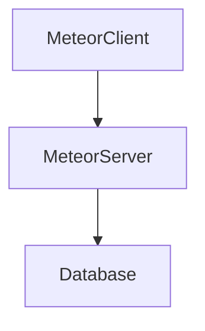

# Calvary Chapel Casper 2025

> https://www.calvarychapelcasper.com


**HTML**: web frameworks: what is on the screen

**CSS**: beautification: make it look pretty

**JS**: functionality: make it do something

Front end web revolves around these three: `HTML | CSS | JS`

## Meteor

https://docs.meteor.com/about/web-apps.html

>   Tiny containers are designed for hobby projects and open-source demos

```bash
meteor create ccc --blaze
```

```bash
meteor deploy ccc
```

https://ccc.meteorapp.com/

----

**Apps** https://galaxy-beta.meteor.com/zbomb/us-east-1/apps

**Container**(s) https://beta.galaxycloud.app/zbomb/us-east-1/apps/ccc.meteorapp.com/overview

## What is Blaze?

BlazeJS is a **reactive UI library** designed for building user interfaces with **HTML templates**. Basically a templating tool for reused JS and HTML

## What is Meteor?

Meteor (or MeteorJS) is a **full-stack JavaScript framework** designed for building **real-time web and mobile applications**. It simplifies development by allowing developers to use **JavaScript for both client-side and server-side code**

Essentially Meteor is a wrapper around `Node.js` that lets you incorporate a database without using something like `express`. By defaualt it uses `MongoDB`, a no-SQL database and talks to *its* server with `Meteor.call` and queries mongo from the server

```ts
			await ServerDB.updateUser(
				{ _id: user._id },
				{
					$set: {
						"user.dataId": iDstring,
					},
				},
			);
```



